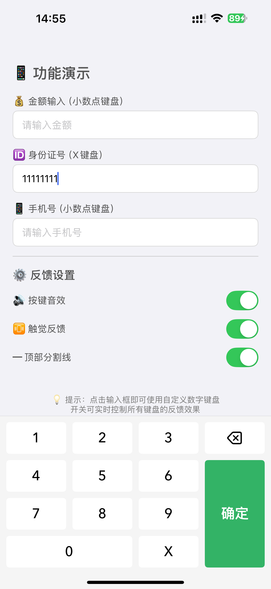
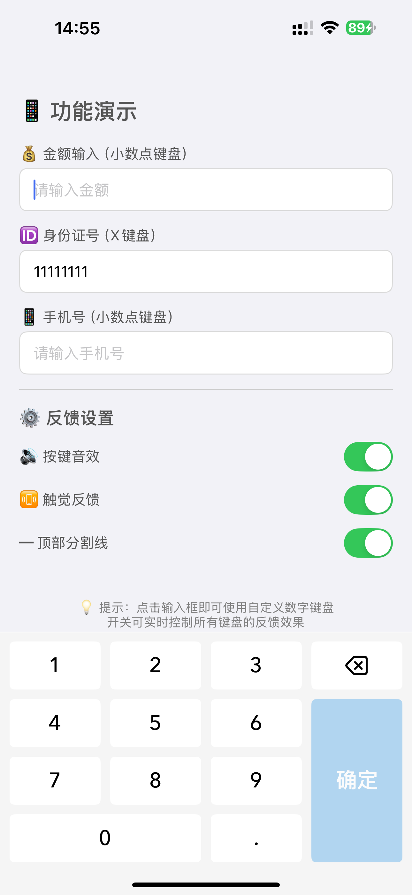

# ZHHNumberKeyboard

[](https://cocoapods.org/pods/ZHHNumberKeyboard)
[](https://cocoapods.org/pods/ZHHNumberKeyboard)
[](https://cocoapods.org/pods/ZHHNumberKeyboard)

一款高度可定制的 iOS 数字键盘组件，完美模仿微信键盘风格，适用于 iOS 应用中的数值输入场景。

## 📸 截图展示

<div align="center">
  
  
</div>

## ✨ 主要特性

- ⌨️ **两种键盘类型**：小数点键盘（金额输入）、身份证键盘（X 键）
- 🎨 **高度自定义**：自定义确定按钮颜色、顶部分割线、按钮样式
- 🔊 **反馈支持**：按键声音反馈、触觉震动反馈（可独立开关）
- 🎯 **智能状态管理**：确定按钮根据输入自动启用/禁用
- ⚡️ **长按快速删除**：长按删除键快速清除内容
- 📱 **完美适配**：自动适配全面屏（iPhone X 及以上）安全区域
- 🔌 **简单集成**：一行代码替换 UITextField/UITextView 键盘

## 📋 版本说明

- **Swift 项目**：请使用 **v1.0.0 及以上版本（最新版本）**
- **Objective-C 项目**：请使用 **v1.0.0 以下版本（最新 0.x 版本）**

## 📱 系统要求

- iOS 13.0+
- Swift 5.0+
- Xcode 12.0+

## 📦 安装

### CocoaPods

在 `Podfile` 中添加：

```ruby
pod 'ZHHNumberKeyboard'
```

然后运行：

```bash
pod install
```

## 🚀 快速开始

### 1. 导入框架

```swift
import ZHHNumberKeyboard
```

### 2. 基础使用

```swift
// 创建键盘实例
let keyboard = ZHHNumberKeyboard()

// 设置为输入框的键盘
textField.inputView = keyboard
```

### 3. 完整示例

```swift
import UIKit
import ZHHNumberKeyboard

class ViewController: UIViewController {
    
    @IBOutlet weak var amountTextField: UITextField!
    
    override func viewDidLoad() {
        super.viewDidLoad()
        
        // 创建小数点键盘（用于金额输入）
        let decimalKeyboard = ZHHNumberKeyboard()
        decimalKeyboard.keyboardType = .decimal
        decimalKeyboard.delegate = self
        
        // 自定义确定按钮颜色
        decimalKeyboard.doneButtonBackgroundColor = UIColor.systemBlue
        
        // 设置反馈选项
        decimalKeyboard.enableClickSound = true
        decimalKeyboard.enableHapticFeedback = true
        
        // 应用到输入框
        amountTextField.inputView = decimalKeyboard
    }
}

// 实现代理方法
extension ViewController: ZHHNumberKeyboardDelegate {
    func numberKeyboardDidTapDone(_ keyboard: ZHHNumberKeyboard) {
        // 处理完成按钮点击事件
        amountTextField.resignFirstResponder()
        print("输入完成：\(amountTextField.text ?? "")")
    }
}
```

## 🎨 自定义样式

### 键盘类型

```swift
// 小数点键盘（用于金额、浮点数等输入）
keyboard.keyboardType = .decimal

// 身份证键盘（显示 X 键）
keyboard.keyboardType = .idCard
```

### 确定按钮颜色

```swift
keyboard.doneButtonBackgroundColor = UIColor.systemBlue
```

### 顶部分割线

```swift
// 显示/隐藏顶部分割线
keyboard.showTopSeparator = true

// 自定义分割线颜色
keyboard.topSeparatorColor = UIColor.lightGray
```

### 反馈设置

```swift
// 启用/禁用按键音效
keyboard.enableClickSound = true

// 启用/禁用触觉反馈
keyboard.enableHapticFeedback = true
```

## 📖 API 文档

### ZHHNumberKeyboardType

键盘类型枚举。

```swift
@objc public enum ZHHNumberKeyboardType: Int {
    /// 展示小数点（用于金额、浮点数等输入）
    case decimal = 0
    /// 展示 "X"（用于身份证输入）
    case idCard = 1
}
```

### ZHHNumberKeyboardDelegate

代理协议，监听键盘事件。

```swift
@objc public protocol ZHHNumberKeyboardDelegate: AnyObject {
    /// 当用户点击"完成"按钮时触发此方法
    /// - Parameter keyboard: 触发事件的数字键盘实例
    @objc optional func numberKeyboardDidTapDone(_ keyboard: ZHHNumberKeyboard)
}
```

### 主要属性

| 属性 | 类型 | 默认值 | 说明 |
|------|------|--------|------|
| `keyboardType` | `ZHHNumberKeyboardType` | `.decimal` | 键盘类型 |
| `doneButtonBackgroundColor` | `UIColor` | 绿色 | 确定按钮背景颜色 |
| `enableClickSound` | `Bool` | `true` | 是否启用按键音效 |
| `enableHapticFeedback` | `Bool` | `true` | 是否启用触觉反馈 |
| `showTopSeparator` | `Bool` | `true` | 是否显示顶部分割线 |
| `topSeparatorColor` | `UIColor` | 浅灰色 | 顶部分割线颜色 |
| `delegate` | `ZHHNumberKeyboardDelegate?` | `nil` | 代理对象 |

### 主要方法

```swift
/// 监听输入内容变化，更新确定按钮状态
/// - Parameter currentText: 当前输入框中的文本内容
@objc public func keyboardInputDidChange(_ currentText: String)
```

## 💡 使用场景示例

### 金额输入

```swift
let keyboard = ZHHNumberKeyboard()
keyboard.keyboardType = .decimal
keyboard.doneButtonBackgroundColor = UIColor.systemGreen
amountTextField.inputView = keyboard
```

### 身份证输入

```swift
let keyboard = ZHHNumberKeyboard()
keyboard.keyboardType = .idCard
idCardTextField.inputView = keyboard
```

### 自定义主题

```swift
let keyboard = ZHHNumberKeyboard()
keyboard.doneButtonBackgroundColor = UIColor(red: 0.2, green: 0.6, blue: 0.9, alpha: 1.0)
keyboard.topSeparatorColor = UIColor.lightGray
keyboard.showTopSeparator = true
textField.inputView = keyboard
```

### 禁用反馈

```swift
let keyboard = ZHHNumberKeyboard()
keyboard.enableClickSound = false
keyboard.enableHapticFeedback = false
textField.inputView = keyboard
```

### 智能确定按钮状态

```swift
// 在 UITextFieldDelegate 中监听输入变化
extension ViewController: UITextFieldDelegate {
    func textField(_ textField: UITextField, shouldChangeCharactersIn range: NSRange, replacementString string: String) -> Bool {
        // 处理输入逻辑...
        
        // 通知键盘输入内容已变化
        if let keyboard = textField.inputView as? ZHHNumberKeyboard {
            DispatchQueue.main.async {
                keyboard.keyboardInputDidChange(textField.text ?? "")
            }
        }
        
        return true
    }
}
```

## 🎯 使用场景

- 💰 支付输入（金额、支付密码）
- 📝 表单填写（身份证号、手机号、邮编）
- 🔢 验证码输入（6 位、4 位数字）
- 📊 数据录入（数值型数据快速录入）

## ⚠️ 注意事项

1. **输入验证**：建议在 `UITextFieldDelegate` 中实现 `textField(_:shouldChangeCharactersIn:replacementString:)` 方法进行输入验证
2. **确定按钮状态**：调用 `keyboardInputDidChange(_:)` 方法更新确定按钮的启用状态
3. **内存管理**：键盘实例会被输入框强引用，无需额外持有
4. **第一响应者**：键盘会自动查找当前的第一响应者，无需手动设置

## 📝 示例项目

运行示例项目：

```bash
cd Example
pod install
open ZHHNumberKeyboard.xcworkspace
```

## 🤝 贡献

欢迎提交 Issue 和 Pull Request！

## 👤 作者

桃色三岁 - 136769890@qq.com

GitHub: [@yue5yueliang](https://github.com/yue5yueliang)

## 📄 许可证

ZHHNumberKeyboard 基于 MIT 许可证开源。详情请查看 [LICENSE](LICENSE) 文件。

## 🙏 致谢

感谢所有为这个项目做出贡献的开发者！

---

如果这个项目对你有帮助，欢迎 ⭐️ Star 支持一下！
